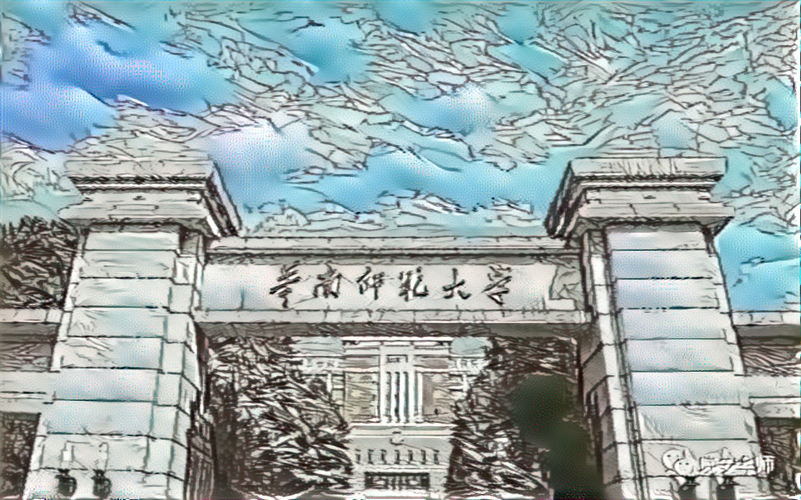

# netrual_style_transfer_by_tensorflow2
netrual style transfer picture

使用tensorflow2.0来实现原始图像风格迁移

给定一张内容图片和一张风格图片，生成一张具备内容图片内容+风格图片风格的图片。

项目结构:  
*`--images`: path to content images and style images that you can choose.  
*`--output`: path for saving output images.  
*`--sameples`: some example of the pics that have been trained.  
*`--model.py`: the model which load the vgg-19 model.  
*`--utils.py`: process pictures.  
*`--setting.py`: parameter configuration file.  
*`--train.py`: train the picture.  

example：  

  
  
   
  
  

learn from :

[有趣的深度学习——使用TensorFlow 2.0实现图片神经风格迁移] https://blog.csdn.net/aaronjny/article/details/104879258

[学习笔记：图像风格迁移]https://blog.csdn.net/czp_374/article/details/81185603
